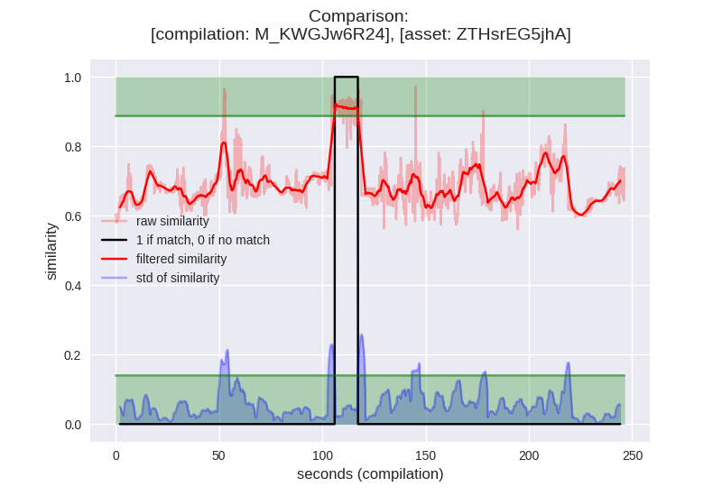

# bergkvist/videoid

Let's say you own the exclusive license to a video clip (an *asset*) on YouTube.

Instead of manually looking through videos (*compilations*) to find out if it contains your *asset*, you wish this process could be automated.

If that is the case, you are in luck. videoid is written in C++, utilizing OpenCV for video processing, and OpenMP for multithreaded performance.


## Table of Contents
 - How it works
 - Getting started
 - Examples
 - Benchmarks
 - Accuracy
 - About
 - Misc


## Getting started
### Requirements
 - `opencv4` (or alternatively `opencv3`, but then you will need to change the `OPENCV`-variable in the `Makefile` from `opencv4` to `opencv`)

### Terminology
Some basic concepts/"big words" will be used as terminology in this project:
 - ***asset***: A video that you own. Your motivation for using this project is that you wish to find your *asset* within other videos (*compilations*)
 - ***compilation***: A video often containing several different clips, where one of these might be yours. In practice, this can be any video you want to check if your asset is inside of.

## Usage
```
Usage: ./bin/main.exe <asset-id> <compilation-id>
  <asset-id>:       The id of a YouTube video that you own
  <compilation-id>: The id of a YouTube video that you want to check
 
NOTE: by setting the environment variable VERBOSE=true, you will get more detailed output when running the program.
```
Recommendation: Use Makefile to rapidly test out some commands:
```bash
# Run a basic comparison where you expect a match
make run
make run-verbose

# Run several comparisons in series
make test  
make test-verbose
```

### Example: input/ouput
```
$ ./bin/main.exe ZTHsrEG5jhA M_KWGJw6R24
asset: ZTHsrEG5jhA | compilation: M_KWGJw6R24 => Match found: https://youtu.be/M_KWGJw6R24?t=106s
```

### Visualization of input/output


### Example: input/verbose output
```
$ VERBOSE=true ./bin/main.exe ZTHsrEG5jhA M_KWGJw6R24

OpenCV version   : 4.1.0
HASH_SIZE        : 32   (This means the images/frames will be resized to 32x32) 
WINDOW_SIZE      : 120  (This is used for computing rolling average and rolling std)
MIN_MATCH_LENGTH : 1    (in seconds. A match must last longer than this)

asset: ZTHsrEG5jhA | compilation: M_KWGJw6R24 => Match found: https://youtu.be/M_KWGJw6R24?t=106s

Elapsed time:
+-------------+---------+-----------------
| Resource    | Action  | Time
+-------------+---------+-----------------
| asset       | load    | 0.00301644 s
| asset       | hash    | 0.133421 s
| compilation | load    | 0.00125059 s
| compilation | hash    | 0.892378 s
| both        | compare | 0.230802 s
+-------------+---------+-----------------
```

With OpenMP
```
./bin/main.exe ZTHsrEG5jhA M_KWGJw6R24

OpenCV version   : 4.1.0
OpenMP version   : 201511
HASH_SIZE        : 32	(This means the images/frames will be resized to 32x32) 
WINDOW_SIZE      : 120	(This is used for computing rolling average and rolling std)
MIN_MATCH_LENGTH : 1	(in seconds. A match must last longer than this)

asset: ZTHsrEG5jhA | compilation: M_KWGJw6R24 => Match found: https://youtu.be/M_KWGJw6R24?t=106s

Elapsed time:
+-------------+---------+-----------------
| Resource    | Action  | Time
+-------------+---------+-----------------
| asset       | load    | 0.00272165 s
| asset       | hash    | 0.119081 s
| compilation | load    | 0.0011063 s
| compilation | hash    | 0.893859 s
| both        | compare | 0.0615238 s
+-------------+---------+-----------------
```
NOTE: Using OpenMP, with 4 cores - we can see that the video comparison is indeed around 4 times faster. Why do we care about improving the comparison speed when it is already faster than the hashing?

The answer is one word: **Scalability**:

| # of compilations   | # of assets | # of hashes | # of comparisons |
|---------------------|-------------|-------------|------------------|
| 1                   | 1           | 2           | 1                |
| 10                  | 1           | 11          | 10               |
| 10                  | 10          | 20          | 100              |
| 100                 | 100         | 200         | 10 000           |
| 1000                | 1000        | 2000        | 1 000 000          |

Notice that as we get more assets, and more compilations, the number of comparisons is what increases the most quickly (assumning we only hash each video once).

### Example: Several comparisons/accuracy of algorithm
```
$ python ./bin/run.py
asset: ZTHsrEG5jhA | compilation: M_KWGJw6R24 => Match found: https://youtu.be/M_KWGJw6R24?t=106s
asset: ZTHsrEG5jhA | compilation: ZTHsrEG5jhA => Match found: https://youtu.be/ZTHsrEG5jhA?t=4s
asset: ZTHsrEG5jhA | compilation: j4hnIAqyhGE => Match found: https://youtu.be/j4hnIAqyhGE?t=44s
asset: ZTHsrEG5jhA | compilation: 9RlBXx8Pf-8 => No matches found
asset: ZTHsrEG5jhA | compilation: B9ypGdx5EXA => No matches found
asset: ZTHsrEG5jhA | compilation: WLrbqsXwKz4 => Match found: https://youtu.be/WLrbqsXwKz4?t=163s
asset: ZTHsrEG5jhA | compilation: 8b1lO5NuaEs => No matches found
```
NOTE: For these videos, it correctly identifies 4 matches and 1 video for not having matches. However, it fails to recognize 2 matches (2 false negatives).
* `B9ypGdx5EXA` - This is easy for the human eye to recognize as a match, but due to some movements/distortions, the algorithm fails. It is likely that the video was being played at a screen, and then filmed with a camera with slight movements.
* `8b1lO5NuaEs` - This has a big black borders, and a huge watermark. These elements combined is likely what makes the algorithm fail.

## Misc
The algorithm uses video only (no audio). It is likely to perform poorly on single-colored backgrounds with text - so try to avoid these in your assets.

### Visualize comparison
This requires that you have Python 3 installed with `matplotlib`, `pandas` and `configparser`.
1. Run the program on any two videos. (Example: `$ make run`) This should generate a csv-file in `./images/`
2. Plot the csv-data using `$ make plot`, and notice the image `./images/out32.png`

### Video Downloads
Any two videos from YouTube can be chosen for comparison, by simply giving their ids to this CLI. If the videos don't exist locally, they will be downloaded and places in `~/.videos/*.mp4`. The filename will be the youtube id, and the video will be kept here in case it is needed later. Note that the `load` timings will be significantly lower the first time.

The `youtube-dl`-binary has been downloaded into `./bin/youtube-dl`, and is used as a dependency of the program for downloading the videos.
