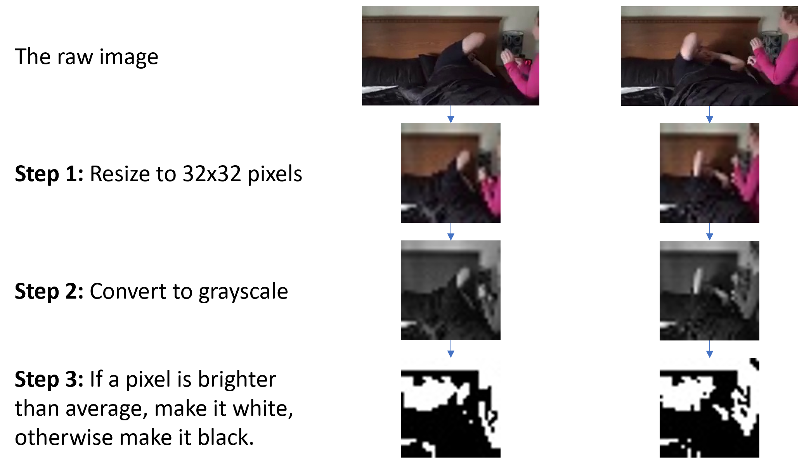
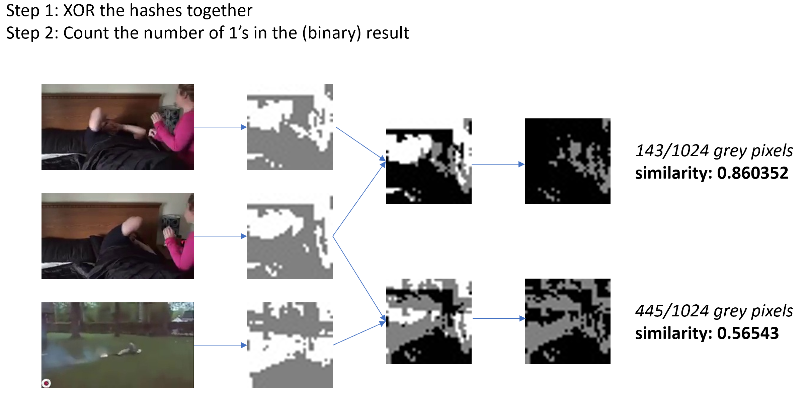

[Back to frontpage](../README.md)

# Theory
The algorithm uses video only (no audio). It is likely to perform poorly on single-colored backgrounds with text - so try to avoid these in your assets.
## Terminology
Some basic concepts/"big words" will be used as terminology in this project:
 - ***asset***: A video that you own. Your motivation for using this project is that you wish to find your *asset* within other videos (*compilations*)
 - ***compilation***: A video often containing several different clips, where one of these might be yours. In practice, this can be any video you want to check if your asset is inside of.
 - ***frame***: A single image from a video. A video might for example have 30 such images within one second.

### A video is simply a sequence of frames
 - This means that comparing a video, boils down to comparing frames
 - Of course a video can also have audio, but this will be ignored in this project

### "Perceptual Hash" vs "Cryptographic Hash"
 - Perceptual hash: A small change in input causes a small change in output. Good for fuzzy matching (this is what we need for video comparison)
 - Cryptographic hash: A small change in input causes a huge and unpredictable change in output. Good for exact matching.

### A Perceptual Image Hash

### Comparing Image Hashes

